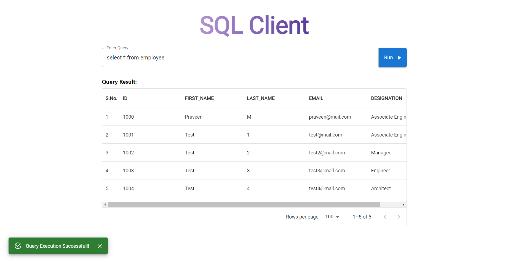
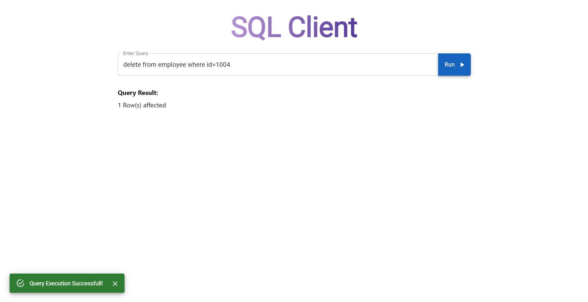
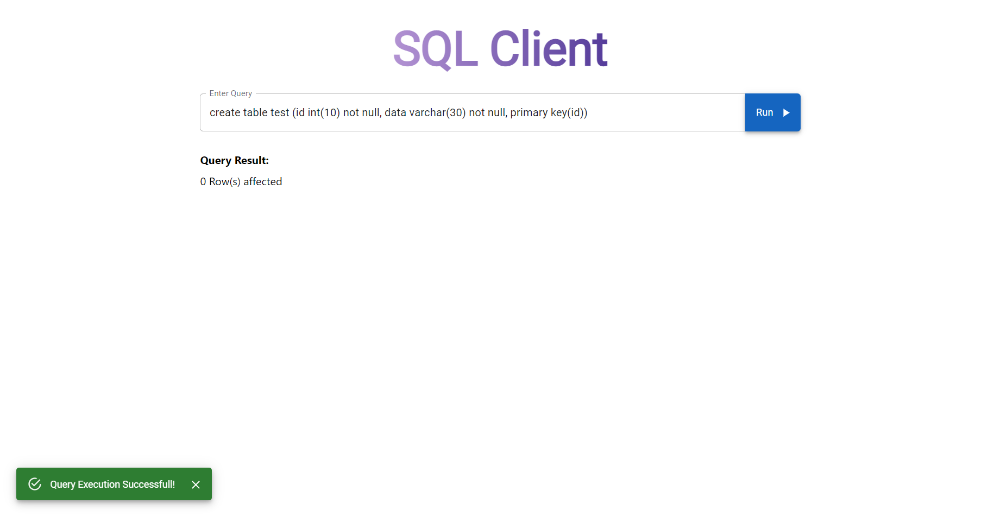
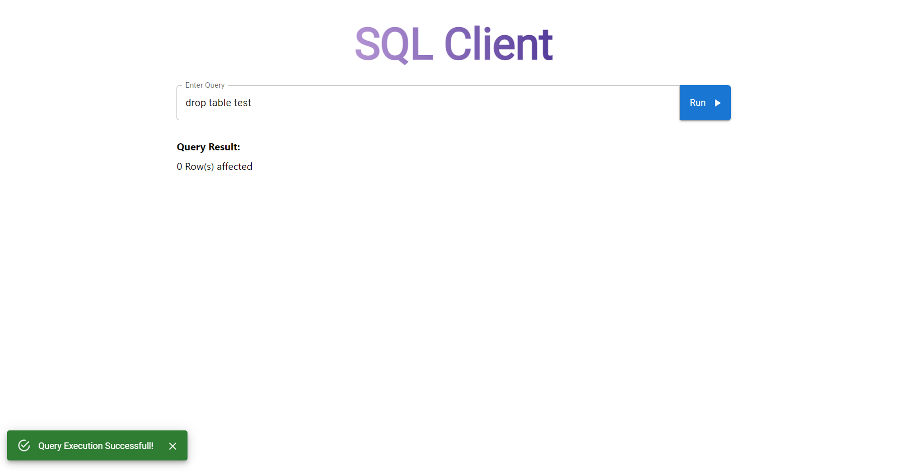
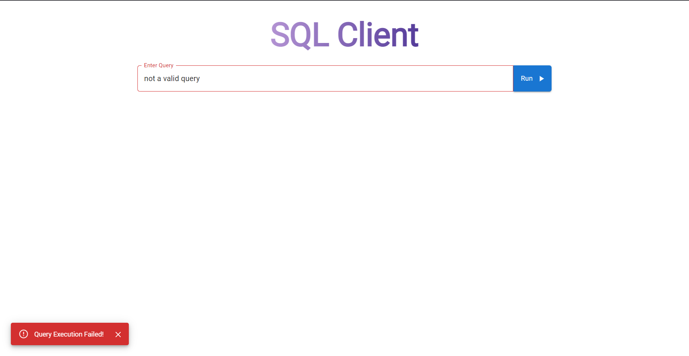

# SQL Client App

`Introduction`

This is a basic fullstack application which can act as an SQL Client.  
It can process **DDL/DML/DQL** queries and renders the query result in the UI.

 

`Tech Stack`

**FrontEnd** | **BackEnd** | **Database**
:--- | :--- | :---
React | Spring Boot | MySQL
Material UI | |

 

`Features`

- The app dynamically renders the output based on the query result. i.e. Table, String.
- The app has alerts as a visual cue to help user understand whether query execution was successfull or not.

 

`Demo`

[Demo Link](https://drive.google.com/file/d/1GyzZjz6y0StQb6YRFF2dExCCchSTjFLl)

 

`Output`

